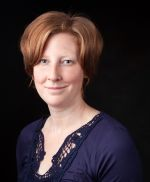

## Darren DePoy
 [Darren DePoy](http://physics.tamu.edu/people/depoy) is the Rachal/Mitchell/Heep endowed professor of Physics and Astronomy and is the head of the Astronomical Instrumentation Lab. He came to Texas A&M in 2008 after working at The Ohio State University for 18 years, where he was the Vice-Chair for Instrumentation. Dr. DePoy has designed and built state-of-the-art optical and infrared astronomical instruments for telescopes all over the world, including OSIRIS currently on the SOAR telescope in Chile, TIFKAM at the MDM Observatory in Arizona, ANDICam at the Cerro-Tololo Interamerican Observatory (CTIO) in Chile, DANDICam at South African Astronomical Observatory, MODS on the LBT telescope in Arizona, a new instrument called [DECam](/instruments/decal) for the CTIO 4-meter telescope, and [VIRUS](http://hetdex.org/hetdex/virus.html), the instrument that supports the Hobby-Eberly Telescope Dark Energy Experiment.
## Jennifer Marshall
 [Jennifer Marshall](http://physics.tamu.edu/people/jlm076) is an assistant professor in the Department of Physics and Astronomy at Texas A&M University. She currently serves as the Project Scientist for the [Maunakea Spectroscopic Explorer](/instruments/mse/) project, a next-generation massively multiplexed spectroscopic survey.  Her scientific interests include the study of near-field cosmology, specifically using metal-poor stars found in the halo of the Milky Way to better understand the formation mechanisms of the Galaxy and of the Universe as a whole. Most recently she has focused on studying the detailed kinematics and chemistry of satellite galaxies of the Milky Way, particularly those that have been discovered by the [Dark Energy Survey](/instruments/des/). In the past she led Texas A&M’s involvement in the Dark Energy Survey, producing the calibration systems that enable the unprecedentedly precise photometric measurements produced by the survey, and also in the HETDEX project, building the [VIRUS](http://hetdex.org/hetdex/virus.html) spectrographs. She is the co-PI of [GMACS](/instruments/gmacs/), the wide field multi-object spectrograph that will be a first-light instrument for the Giant Magellan Telescope.  

## Luke Schmidt
 [Luke Schmidt](https://physics.tamu.edu/people/lschmidt/) is an Assistant Research Scientist in the Astronomical Instrumentation Lab where he helps manage the day-to-day activities of the lab and fills various roles in the lab instrumentation projects including management, optical and opto-mechanical design, detectors, and control systems. Dr. Schmidt has been involved with the development of several other optical and infrared astronomical instruments including AMASING (Aperture Masking And Speckle ImagiNG), NESSI (New Mexico Exoplanet Spectroscopic Survey Instrument) both at the Magdalena Ridge Observatory 2.4m Telescope. Before coming to Texas A&M he was an Instrumentation Scientist with the Magdalena Ridge Observatory Interferometer project. There he helped develop ICoNN, the Infrared Coherencing Nearest Neighbor fringe tracker as well as several other subsystems related to beam transport and automated alignment.
## Erika Cook
 Erika Cook is an Electrical Engineer at the Astronomical Instrumentation Lab working on the software and controls for [GMACS](/instruments/gmacs/) and the [Boller & Chivens 16 inch telescope mount.](http://instrumentation.tamu.edu/instruments/bctelescope/) Her past projects include prototyping and testing the cooling system for the [VIRUS enclosures](/instruments/hetdex/#virus-enclosures), and writing control software for the [BINOSPEC](/instruments/binospec/) calibration screen.

## Mary Anne Limbach

Mary Anne Limbach is an Optical Engineer in the Astronomical Instrumentation Lab where she working on [GMACS](/instruments/gmacs/) Mrs. Limbach has worked in the instrumentation field for nearly a dozen years and has been lead optical engineer on several instruments including an exoplanet direct-imaging integral field spectrograph (CHARIS) for the Subaru telescope built at Princeton University and an instrument designed to test coronagraphs (BESSEL) at the University of Arizona.

## Irfan Beg

Irfan is a Mechanical Engineering Specialist. He graduated from Texas A&amp;M University with a degree in mechanical engineering and is working on the GMT mirror support actuator project as well as various other lab projects.

## Lauren Aldoroty
Lauren Aldoroty is a graduate student in the Department of Physics and Astronomy. She is interested in spectroscopy and applications of 3D printing to astronomical instrumentation. Lauren is currently investigating the feasibility of using commercially available 3D printing materials for slit mask manufacturing.

## Peter Ferguson
Peter Ferguson is a graduate student. Interested in instrumentation, statistics, and observational astronomy. Currently working on characterizing the near infrared sky emission at Gemini Observatory using F2 particularly in the k-band.

## Leonardo Barba
Leonardo Barba is an undergraduate Physics major who has been working on hardware and software for TCal and ETSI while also helping put together ETSI. He also helps with general lab necessities and monthly Star Parties.

## Leonardo Bush
Leonardo Bush is an undergraduate Physics major minoring in Computer Science and Mathematics. He works on multiple projects in the lab that include GMT Actuators, MUTE, and TCAL. His work includes designing new ideas and coming up with solutions to any challenge that needs to be tackled.

## Cole Mason

Cole Mason is an undergraduate Physics major. He helps with the GMT and GMACS. He plans to minor in Astronomy and Mathematics.

## Evan Kelly
Evan Kelly is an Aerospace Engineering Major and is minoring in mathematics. Through the use of advanced analytical calculations and streamlined modeling, Evan is paving a new path in the field of Astronomy. Time in the lab is spent developing a prototype scale model of the GMACS.

## Cynthia Froning

Cynthia Froning is a visiting scholar who specializes in the development of ultraviolet, optical, and near-infrared cameras and spectrographs and enabling technologies for future instruments. She uses multiwavelength observations to address a number of research questions, with a particular interest in the physics of accretion disks and outflows and the properties of exoplanet systems in the ultraviolet.

 
## Previous Team Members
[Click here](/people/previous/) for a list of previous team members. *Please note that some information may be outdated.*
